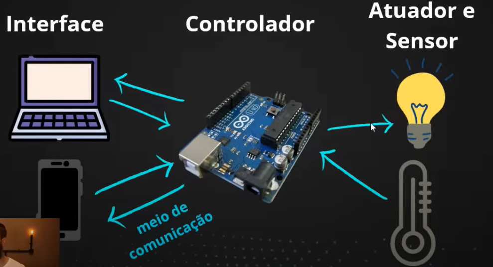

# Aula 01 - A caixa preta da Automação

## O que é Automação Residencial?

É o uso da tecnologia para facilitar e tornar automático as tarefas da casa.
Exemplos: acender/apagar lâmpadas, ligar/desligar aparelhos de TV, ar-condicionado, abrir/fechar portões, entre outras aplicações.

## Áreas da Automação

Existem 3 áreas que devem ser levados em consideração nos projetos de automação. A importância e a ênfase em cada uma dessas áreas vai depender dos objetivos de cada projeto. Os pilares são:

### Economia
- Apagar luzes fora de casa;
- Programar horários para ligar e desligar;
- Desligar o ar-condicionado em horários pré-programados.

### Segurança
- Saber se alguém abriu a porta ou janela da casa;
- Alertas de fogo/fumaça ou vazamento de gás.

### Conforto
- Controlar toda a casa pela palma da mão ou por um simples comando de voz

## Pilares da Automação

## Meios de comunicação
Exitem várias formas que podemos utilizar para enviar os comandos da interface para o microcontrolador, a depender do projeto. Alguns exemplos são:c
- Bluetooth
- Ethernet
- Wi-fi
- Rádio Frequência