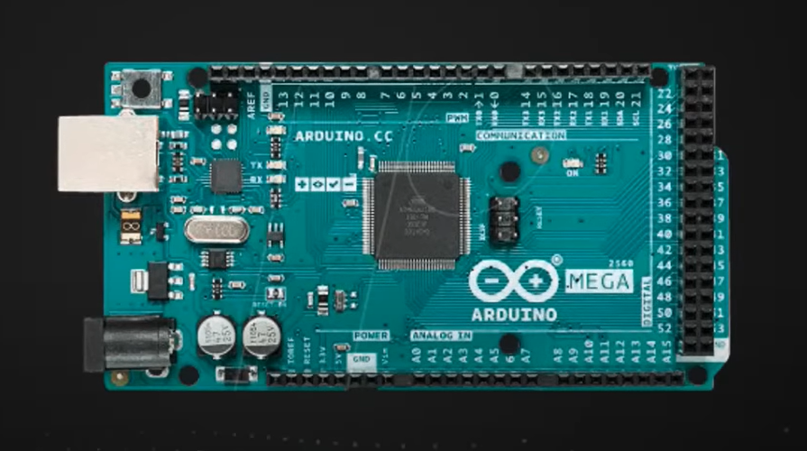

# Aula 02 - Criando a sua primeira automação

## O que é Arduino?
O Arduino é uma solução completa de Hardware e Software para desenvolvimento de projetos. As possibilidades de aplicação do Arduino são inúmeras.

## Hardware

- Porta USB: possibilita a comunicação do Arduino com o computador e também pode ser usado como fonte de alimentação. É por onde será enviado todo o código fonte e por onde são enviados e recebidos comandos. Conversor Serial <-> USB
- Alimentação: de 7V a 12V.
- Microcontrolador: o "cérebro" do Arduino, armazena os códigos, lê dados de entrada e executa as saídas.
- Terminais de alimentação: possui saídas de 3,3V, 5V e 0V (terra).
- Entradas e Saídas: entradas podem ser digitais (0 ou 1; ligado ou desligado; aberto ou fechado; aceso ou apagado) ou analógicas (possui uma escala de valores).
Exemplos de sensores digitais: sensor de presença, sensor de caixa d'água, sensor de porta aberta ou fechada.
Exemplo de sensores analógicos: sensor de temperatura, sensor de corrente, sensor de luminosidade, sensor de humidade.
Cada pino pode assumir a função de entrada OU saída, o que será definido na programação.
- Portas PWM (Pulse Width Modulation): alguns pinos de entrada/saída (marcados por um ~ antes do número) possuem essa função. Ela transformar uma saída digital em analógica. Exemplo: ao invés de ligar ou desligar uma lâmpada, ele pode controlar a intensidade luminosa da mesma. A velocidade de um motor também é um exemplo de uso das saídas PWM.
- Existem shields p/ conectar Arduino ou ESP sem precisar soldar.

## Software
- IDE do Arduino
- Linguagem C++

### Estrutura básica do código

```c++
void setup(){
    // executa apenas uma vez quando o Arduino é ligado
}

void loop(){
    // executa constantemente
}
```

### Controlando as portas
```c++
// Define se é entrada ou saída
pinMonde(pin,funcao); 

// Exemplos
pinMode(5,OUTPUT);
pinMode(10,INPUT);
```
### Ligando ou desligando uma porta
```c++
digitalWrite(pin,HIGH);
digitalWrite(pin,LOW);
```

### Lendo o estado de uma porta
```c++
digitalRead(pin);
```

## Modelos de Microcontroladores
### Arduino Uno

- Arduino de entrada
- Microcontrolador SMD
- 14 entradas/saídas digitais
- 6 entradas analógicas/saídas digitais
- Recomendado p/ iniciantes

### Arduino Nano

- Tamanho reduzido
- Possui duas entradas analógicas a mais
- Recomendado p/ projetos mais enxutos

### Arduino Mega

- 54 entradas/saídas digitais
- 16 entradas analógicas
- Recomendado p/ projetos grandes

### ESP8266

- Existem diversos modelos
- Possui Wi-Fi embutido
- Possui diversas entradas/saídas digitais, porém somente uma entrada analógica

### ESP32

- Wi-Fi e Bluetooth embutido
- Diversas entradas digitais e analógicas


## Ligando e desligando equipamentos com o Arduino
### Módulo Rele

Componente eletromecânico composto por uma bobina e contatos abertos e fechados. Funciona de forma semelhante a um interruptor, porém, o rele funciona através de sinais elétricos.

### Controlando aparelhos que possuem controle remoto
Podem ser controlados clonando os comandos dos controles remotos desses equipamentos e enviando-os pela interface do sistema de automação. Os controles remotos funcioanam da seguinte forma:

LED semalhante ao que existe nos controles remotos, enviam sinais infra-vermelhos p/ controlar equipamentos como TVs e ar-condicionados.


Receptor de infra-vermelho, responsável por ler os comandos enviados pelo LED do controle.
Ligado diretamente ao Arduino, pode ser utilizada a biblioteca IRRemote para ligá-lo. Ao pressionar os botões do controle, ele lê os comandos e retorna o seu respectivo código para criar o clone do controle.


## Links úteis
- [Tinkercad](https://www.tinkercad.com/dashboard)
- [Wokwi](https://wokwi.com)
- [Arduino IDE](https://www.arduino.cc/en/software)
- [Arduino IDE Online](create.arduino.cc/editor)


## Projeto Prático
O projeto desenvolvido em aula pode ser acessado [aqui](https://www.tinkercad.com/things/irFmPqTgYkO).