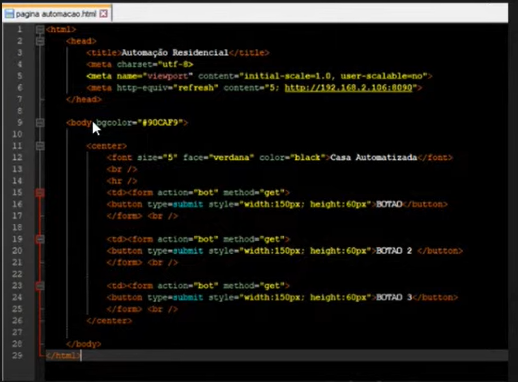

# Aula 03 - Controlando tudo pelo celular

## O que é interface?
É a forma de comunicação entre o usuário e o sistema.
Exemplos: interruptor, aplicativo de celular/computador, página web, smart speaker, assitentes.

## Criando a interface (app)
Existem várias opções para criar uma aplicação. Podem ser utilizadas as plataformas App Inventor ou Thunkable para criar aplicativos para Android e IOS, respectivamente.
Uma outra alternativa é criar utilizando HTML, sem ter limitação de dispositivos.

Os dispositivos IOS também contam com uma solução integrada para automação, podendo criar atalhos e integrar com a Siri.
Também existem diversas soluções prontas no mercado, como o app Blynk IoT, o Arduino IoT Cloud Remote e o ESP RainMaker.

## Links Úteis
- [App Inventor](http://appinventor.mit.edu)
- [Thunkable](https://thunkable.com/#/)
- [Blynk IoT page](https://blynk.io)
- [Blynk IoT download](https://play.google.com/store/apps/details?id=cloud.blynk&hl=en&gl=US)
- [Arduino IoT Cloud Remote download](https://play.google.com/store/apps/details?id=cc.arduino.cloudiot&hl=en&gl=US)
- [ESP RainMaker page](https://rainmaker.espressif.com)
- [ESP RainMaker download](https://play.google.com/store/apps/details?id=com.espressif.rainmaker&hl=en&gl=US)

## App desenvolvido
O app desenvolvido durante a aula pde ser conferido [aqui](./app/semana_automacao_aula03.apk).